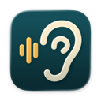

# Earshot

**Every word your Mac hears, on your Mac.** Live transcripts with speakers and translation, fully on-device.

**[Download for macOS](https://github.com/gabrielcosi/earshot/releases/latest)**

Earshot lives in the menu bar of Apple silicon Macs running macOS 26.4 or newer. Start listening when a call begins, or when a video or podcast plays, in any app: it transcribes what you say and everything the Mac plays, tells the speakers apart, and translates what is not in your language as it goes.

- **Nothing leaves your Mac.** Speech recognition and speaker detection run on the Mac's GPU with NVIDIA's Nemotron models. Translation and summaries use Apple's on-device models.
- **You and everyone else.** Your microphone is always "Me". Everything the Mac plays is split into up to eight speakers, and you name them when you stop.
- **Many languages at once.** Recognition follows the language each person speaks, and anything not in your language is translated.
- **Plain files.** Every transcript is saved after each finished line and written out as a Markdown file when the session ends.

## Install

1. [Download the latest DMG](https://github.com/gabrielcosi/earshot/releases/latest) and open it.
2. Drag `Earshot.app` into Applications, then launch it.
3. Earshot opens **Settings > Models**. Download a transcription model, and a speaker detection model if you want speakers.

The first time you start listening, macOS asks for two permissions:

- **Microphone** lets Earshot transcribe what you say. It is only needed while **Include my microphone** is on.
- **System Audio Recording** lets Earshot hear the other side of the call, from whatever app plays it.

Earshot checks for signed updates automatically. Use **Check for Updates…** in the Earshot menu or in **Settings > About** to check now.

## Use

Click the ear in the menu bar and choose **Start Listening**, or, with the Earshot window open, click **Start Listening** at the top of the sidebar or press ⌘N. The transcript window opens and fills in as people speak: each finished line becomes a card, and the words still being recognized wait at the bottom, under the time, a level meter for you and for what the Mac plays, and **Stop**. Choose **Stop** there or in the menu when you're done: Earshot tidies the speaker boundaries and opens the speakers beside the transcript, with a few of their lines to read and play, to name them. Return saves a name, ⌘Z undoes it, and **Done** closes the panel; **Name Speakers** in the toolbar opens it again.

The window lists your transcripts by day, with the session in progress on top. Press ⌘+ and ⌘− to change the text size, and use the switch in the toolbar to show the original, the translation, or both. Everything else is in **Settings** (⌘,).

- **Spoken** in the menu sets which languages are spoken, so Earshot ignores languages it mishears in noise.
- **Translate into** your language translates every line in another language. macOS asks to download a language pair the first time it is needed.
- **Listening to** in the menu picks the apps to transcribe, for a call next to music or a video. It starts on all apps. Two tabs in the same browser count as one app.
- **Include my microphone** can be turned off to transcribe a podcast or a video with nobody talking over it.
- **Settings > Words** holds names and terms Earshot should recognize, and replacements to apply to the text.
- **Summarize** in the transcript's toolbar adds an overview, decisions, and action items above it, every time you stop if you turn that on in **Settings > Summaries**. Apple Intelligence writes them unless you choose an endpoint.
- **Keep audio** keeps a recording of your microphone and the Mac's sound with each transcript: about 23 MB an hour at Low, 35 at Medium, and 45 at High, chosen under **Audio Quality** in **Settings > General**. With **Cancel speaker echo** on, your microphone is kept as the engine hears it. The transcript then opens with a player that plays both sides in both ears: click the waveform, or a line's play button, to listen from there. Space plays and pauses. **Show Audio in Finder** and **Export Audio…** are under **Show in Finder** in the toolbar; **Export Audio…** writes both sides mixed into one channel, which plays in both ears anywhere.

Earshot keeps your transcripts in its own library and writes a Markdown copy of each one to Earshot's folder, or to a folder you choose in **Settings > General**. It keeps the copy up to date as you name speakers or add a summary. Once you change or delete a copy outside Earshot, Earshot leaves it alone and says so above the transcript; **Export…** writes a new one. Transcripts saved by Earshot 0.1 are imported into the library the first time a newer version opens, with their kept audio. The files themselves are left as they are.

## Privacy

Audio never leaves your Mac. Recognition, speaker detection, and translation all run locally, and audio is only kept after a session when **Keep audio** is on; until you're done naming the speakers, the session's recording waits in a temporary file so you can listen to them. Transcripts and kept audio stay on your Mac, in Earshot's own storage.

Earshot goes online for three things:

- **Models** download from Hugging Face when you choose them in **Settings > Models**.
- **Updates** are checked against this repository's GitHub releases.
- **Summaries**, only when you choose an OpenAI-compatible or Anthropic endpoint instead of Apple Intelligence. The transcript text is then sent to that endpoint. Its API key is kept in your keychain.

## Troubleshooting

**The other side of the call is missing.** Check that Earshot is allowed under **System Settings > Privacy & Security > Screen & System Audio Recording**.

**Every line appears twice, once as "Me".** Without headphones, the microphone hears the other side of the call through the speakers. Use headphones, or turn on **Cancel speaker echo** in **Settings > Microphone** when you listen on speakers. When you are only listening, turn off **Include my microphone**.

**A language comes out wrong.** Choose the languages that are spoken under **Spoken**. With one language chosen, Earshot transcribes only that language.

**Names come out misspelled.** Add them in **Settings > Words**. Earshot listens for them and fixes them in the final text.

## Contributing

Building, tests, and releases are covered in [CONTRIBUTING.md](CONTRIBUTING.md).

## License

Apache License 2.0, see [LICENSE](LICENSE). Third-party components are listed in [THIRD_PARTY_NOTICES.md](THIRD_PARTY_NOTICES.md).
